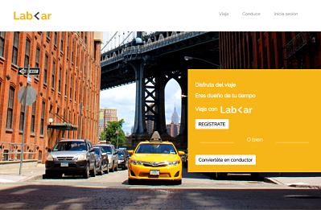

# RETO N° 2 : "LabCar"
LabCar es una página web con diseño responsive que utiliza el framework Bootstrap ,así como el API de Google maps para el trazado de rutas.    

## Desarrollado para [Laboratoria](http://www.laboratoria.la/)

